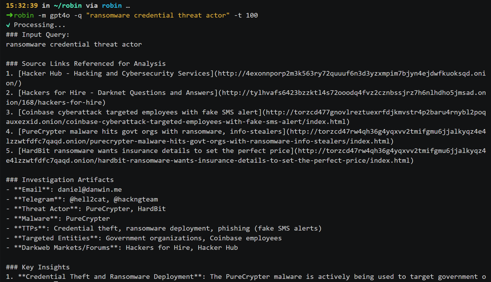

<div align="center">
   
   <br><a href="https://github.com/apurvsinghgautam/robin/actions/workflows/binary.yml"></a> <a href="https://github.com/apurvsinghgautam/robin/releases"></a>
   <h1>Robin: AI-Powered Dark Web OSINT Tool</h1>

   <p>Robin is an AI-powered CLI-based tool for conducting dark web OSINT investigations. It leverages LLMs to refine queries, filter search results from dark web search engines, and provide an investigation summary.</p>
   <a href="#installation">Installation</a> &bull; <a href="#usage">Usage</a> &bull; <a href="#contributing">Contributing</a> &bull; <a href="#acknowledgements">Acknowledgements</a><br><br>
</div>



---

## Features

- ⚙️ **Modular Architecture** – Clean separation between search, scrape, and LLM workflows.
- 🤖 **Multi-Model Support** – Easily switch between OpenAI, Claude, or local models like Ollama.
- 💻 **CLI-First Design** – Built for terminal warriors and automation ninjas.
- 🐳 **Docker-Ready** – Optional Docker deployment for clean, isolated usage.
- 📝 **Custom Reporting** – Save investigation output to file for reporting or further analysis.
- 🧩 **Extensible** – Easy to plug in new search engines, models, or output formats.

---

## Installation
> [!NOTE]
> The tool needs Tor to do the searches. You can install Tor using `apt install tor` on Linux/Windows(WSL) or `brew install tor` on Mac. Once installed, confirm if Tor is running in the background.

### Release Binary (Recommended)

- Download the appropriate binary for your system from the [latest release](https://github.com/apurvsinghgautam/robin/releases/latest)
- Unzip the file, make the binary executable with `chmod +x robin`, and run as

```bash
robin -m gpt4o -q "ransomware payments"
```

### Using Python (Development Version)

- With `Python 3.10+` installed, run the following:

```bash
pip install -r requirements.txt
python main.py -m gpt4o -q "ransomware payments" -t 12
```

> [!TIP]
> You can provide OpenAI or Anthropic key by either creating .env file (refer to sample env file in the repo) or by setting env variables in PATH

### Docker Image

- Build the Docker Image:

```bash
docker build -t robin .
```

- Run the Container:

```bash
mkdir -p output
docker run --rm \
   -v "$(pwd)/.env:/app/.env" \
   -v "$(pwd)/output:/app/output" \
   robin --model gpt4o --query "dark web financial fraud" --output results
```

---

## Usage

```bash
Robin: AI-Powered Dark Web OSINT Tool

options:
  -h, --help            show this help message and exit
  --model {gpt4o,claude-3-5-sonnet-latest,llama3.1}, -m {gpt4o,claude-3-5-sonnet-latest,llama3.1}
                        Select LLM model (e.g., gpt4o, claude sonnet 3.5, ollama models)
  --query QUERY, -q QUERY
                        Dark web search query
  --threads THREADS, -t THREADS
                        Number of threads to use for scraping (Default: 5)
  --output OUTPUT, -o OUTPUT
                        Filename to save the final intelligence summary. If not provided, a filename based on the
                        current date and time is used.

Example commands:
 - robin -m gpt4o -q "ransomware payments" -t 12
 - robin --model claude-3-5-sonnet-latest --query "sensitive credentials exposure" --threads 8 --output filename
 - robin -m llama3.1 -q "zero days"
```

---

## Contributing

Contributions are welcome! Please feel free to submit a Pull Request.

- Fork the repository
- Create your feature branch (git checkout -b feature/amazing-feature)
- Commit your changes (git commit -m 'Add some amazing feature')
- Push to the branch (git push origin feature/amazing-feature)
- Open a Pull Request

Open an Issue for any of these situations:
- If you spot a bug or bad code
- If you have questions or about doubts about usage

---

## Acknowledgements

- Idea inspiration from [Thomas Roccia](https://x.com/fr0gger_) and his demo of [Perplexity of the Dark Web](https://x.com/fr0gger_/status/1908051083068645558).
- Tools inspiration from my [OSINT Tools for the Dark Web](https://github.com/apurvsinghgautam/dark-web-osint-tools) repository.
- LLM Prompt inspiration from [OSINT-Assistant](https://github.com/AXRoux/OSINT-Assistant) repository.
